# Davey Rockets | DeFi/Web3 Engineer • Smart Contracts & Full‑Stack

Welcome! I'm Dave, a **DeFi/Web3 & Full‑Stack engineer** focused on smart contracts, defi apps, and production‑grade full‑stack dapps. I combine a finance/M&A background with rigorous engineering to ship secure, gas‑efficient, and user‑centric onchain products.

---

## About Me

Full-stack blockchain engineer with deep experience in Solidity, ERC-115, ERC-4337, and React/Next.js. I leverage financial modeling and due-diligence experience to design robust DeFi systems with clear risk controls, strong test coverage, and pragmatic DevEx. Passionate about shipping real products that balance security, performance, and UX.
## Professional Experience

* **Director of M\&A | VetEvolve** *(May 2024 - Present)*

  * Lead detailed business valuation analyses, resulting in improved EBITDA accuracy.
  * Manage end-to-end transaction lifecycles, enhancing strategic investment decisions.
  * Streamline financial due diligence processes, significantly reducing processing times.

* **Director of Mergers & Acquisitions | Destination Pet** *(Nov 2022 - Jan 2024)*

  * Successfully oversaw the acquisition and integration of 67 veterinary practices.
  * Directed a team of analysts to achieve record-setting growth through strategic acquisitions.
  * Improved operational efficiency in valuation and financial modeling processes.
## Education

* **Full Stack Web3 Advanced Solidity Bootcamp** *(Metana, May 2024 - June 2025)*
* **BS, Business Administration** *(California Lutheran University, 2015)*

---

## Tech Stack

**Blockchain:**
        

**Full-Stack:**
             

**Databases & DevOps:**
         

**Data & AI:**
 

## Security & CI

* CI gates: build, tests, coverage (lcov), gas snapshots on PRs.
* Security: Slither static analysis; linting with Solhint.
* Artifacts: coverage and gas reports uploaded in CI.
## Areas of Expertise

* Account Abstraction (ERC‑4337): paymasters, SimpleAccount flows, userOp UX
* DeFi protocol patterns: budgets/caps, staking/rewards, vault‑style controls
* Gas optimization and testing: Foundry test suites, coverage, fuzz/invariant tests
* Secure token standards & receipts: ERC‑721 SBT (ERC‑5192), ERC‑1155
* Offchain integrations: Chainlink Functions/Automation, event‑driven jobs

---

## Projects

### Featured

#### DAO Gas Reimbursement Paymaster (ERC-4337)

* **Role:** Smart Contract + Full-Stack Developer
* **Stack:** Solidity, Foundry, OpenZeppelin, ERC-4337 (EntryPoint v0.8), TypeScript, Next.js, viem, wagmi, GitHub Actions, Slither, Solhint
* **One-liner:** A verifying paymaster that sponsors gas for allowlisted smart accounts with monthly budgets, safety caps, and optional SBT receipts—plus a dashboard and reproducible local demo.
* **Live:** https://dao-gas.vercel.app/
* **On-chain:**
  * BudgetPaymaster: per-sender monthly budgets, sender allowlist, per-op and fee caps, global cap, UTC month rollover, deposit/stake helpers, optional ReceiptNFT mint in postOp.
  * ReceiptNFT (SBT): ERC-721 with ERC-5192 "locked" semantics, one receipt per sponsored op.
  * GovActions: tiny target contract to demo allowlisting and sponsored calls.
* **Off-chain / Web:**
  * Next.js dashboard (wagmi/viem): view budget, call demo actions, preview AA userOps.
  * Scripts + Makefile: deploy, stake/deposit, seed budgets, set caps/global cap, local end-to-end demo.
  * CI: forge build/test, coverage (lcov), gas snapshots, Slither, Solhint, web build/lint.
* **How it works:** Validates UserOperations against sender budget and safety caps during validatePaymasterUserOp, then debits actual gas costs in postOp. Budgets reset at UTC month boundaries. Each sponsored op can mint a soulbound receipt.

#### BallKnower (RAG + MLB analytics)

* **Live:** https://ballknower.vercel.app/
* **What it is:** Next.js app that helps fantasy managers plan and draft. Blends MLB season lines, user-uploaded projections, and Baseball Savant skill metrics (EV, Barrel%, xwOBA) into a pgvector‑backed RAG pipeline, then streams GPT answers with citations, player comparisons, and a cheat‑sheet generator. Hybrid retrieval (vector + trigram), Redis caching, and unit/golden tests keep it fast and trustworthy.
* **Tech stack:** Next.js 14 (TS, App Router), Tailwind/shadcn, OpenAI (chat + embeddings), Prisma, Supabase Postgres + pgvector, Upstash Redis, Vitest, pino.
* **Key features:**
  * CSV projection upload, merge, anomaly flags
  * Skill Cards from Statcast; season/intent-aware retrieval
  * Streaming chat with citations; compare view; cheat-sheet generator
  * ETL + embedding jobs, rate limiting, logging, and golden tests

#### [OddScout](https://odd-scout.vercel.app/)

OddsScout compares MLB odds between sportsbooks and Polymarket, surfaces arbitrage deltas, and records insights on-chain via a Solidity contract and Chainlink Functions/Automation.

#### [Bulldog NFT Forge](https://bulldog-nft.vercel.app/)

Web3 app demonstrating minting, forging, burning, and trading of NFTs with ERC-1155 contracts deployed on Polygon Amoy.

#### [DishSwap](https://dishswap.vercel.app/)

Social recipe dapp with image uploads, JWT auth, reactions, and comments; modern Next.js + MongoDB stack with polished UX.

  
<strong>Project Archive</strong>

  * [**Personal Portfolio**](https://daveyrockets.me/)
    Portfolio showcasing JWT authentication, protected routes, blog functionality, backend processing, responsive design, and Tailwind CSS.

## What I’m Looking For

* Roles: Smart Contract Engineer, DeFi Protocol Engineer, Web3 Full‑Stack
* Focus areas: ERC‑4337/AA, protocol design, L2s, security & testing, Chainlink integrations
* Engagements: Full-time or contract; remote-friendly
## Connect With Me

**Interested in collaborating or exploring opportunities?** Let's connect and innovate together in blockchain and Web3 development!
## Goals

* Master Web3 technologies and continuously launch innovative decentralized apps.
* Collaborate within the developer community to drive innovation in blockchain and decentralized finance.
* Integrate my financial expertise with technological innovation to create secure and impactful blockchain solutions.

---

### 📊 GitHub Stats

  

  
  

  

*P.S.: Feel free to leave feedback or connect—I’m always up for collaborating and learning!* 🚀

Support me here 👉 daveyrockets.eth
