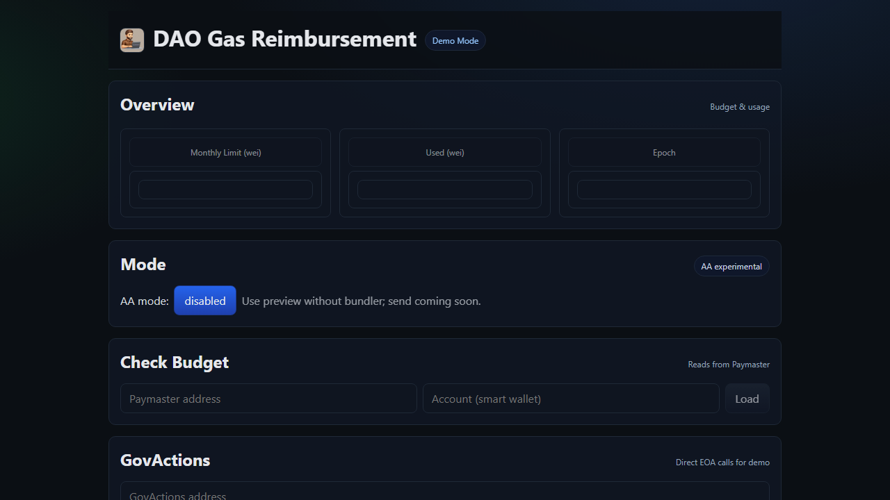
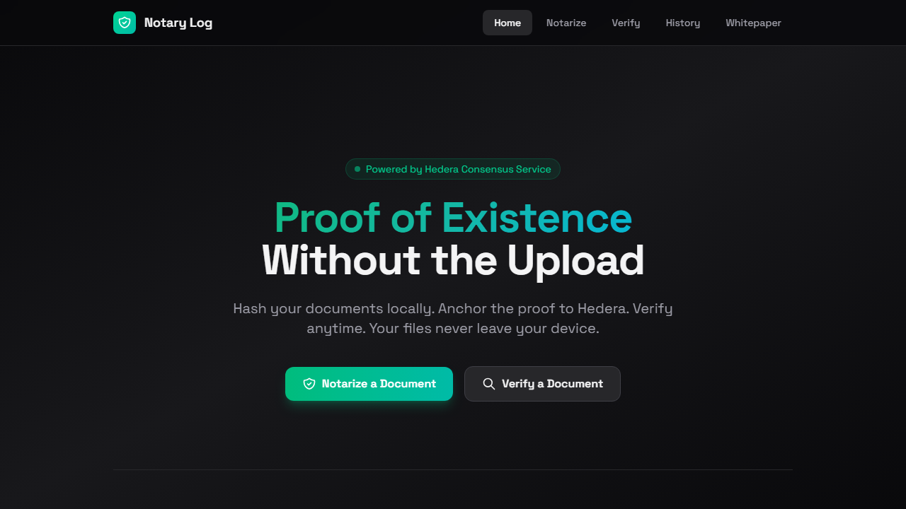
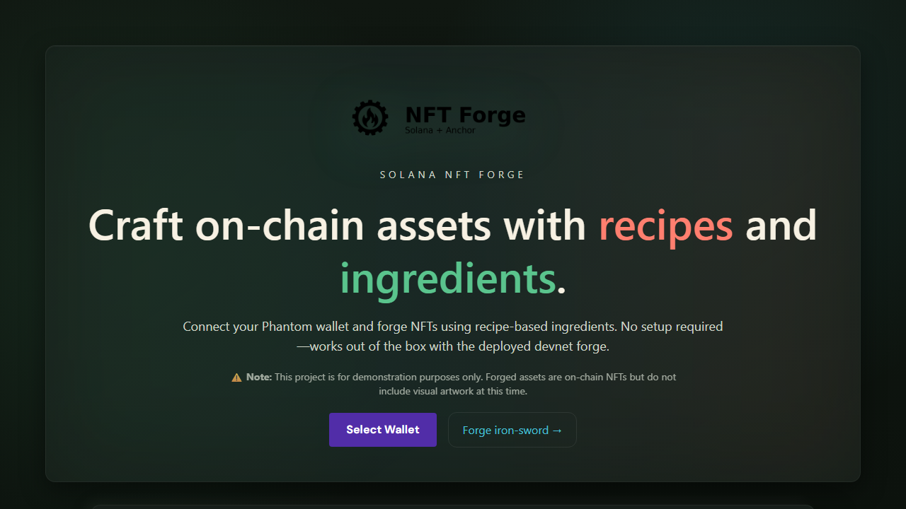
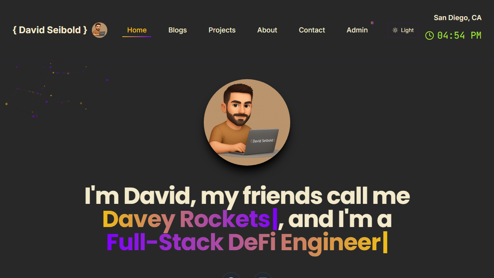
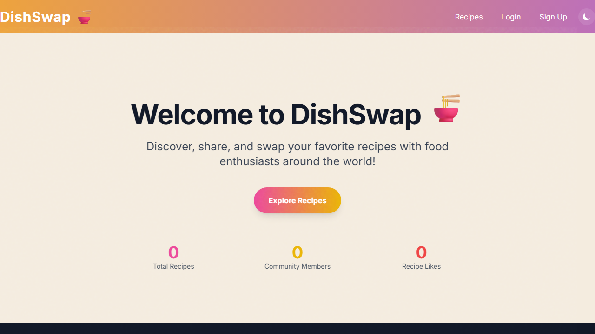

# David Seibold · Full-Stack DeFi Engineer

Ten years in M&A taught me how to model risk, cap exposure, and stress-test assumptions. I apply that same discipline to smart contracts, paymasters, and full-stack dApps — with Foundry coverage, Slither gates, and live demos you can click through.

**Portfolio → [daveyrockets.me](https://daveyrockets.me)** · Resume & blog · **ENS → daveyrockets.eth**

---

## Building Now

- **[defi-kpi-publisher](https://github.com/PenneconDavid/defi-kpi-publisher)** — CRE-driven DeFi KPI oracle that toggles onchain risk mode when SaaS metrics cross policy thresholds
- **[DAO Gas Reimbursement Paymaster](https://github.com/PenneconDavid/DAO-Gas-Reimbursement-Paymaster)** — ERC-4337 paymaster with monthly budgets, safety caps, and optional SBT receipts
- **[Solana NFT Forge](https://github.com/PenneconDavid/Solana-NFT-Forge-with-Anchor)** — Anchor program for constraint-based asset forging on devnet

*Last updated: July 2026*

---

## Featured Work

| | Project | What it proves |
|:---:|:---|:---|
|  | **[DAO Gas Paymaster](https://github.com/PenneconDavid/DAO-Gas-Reimbursement-Paymaster)** | Budget controls inspired by financial modeling — allowlisted smart accounts, monthly caps, global safety limits |
|  | **[Hedera Notary Log](https://github.com/PenneconDavid/Hedera-Notary-Log)** | Local document hashing + HCS anchoring for verifiable timestamps without uploading files |
|  | **[Solana NFT Forge](https://github.com/PenneconDavid/Solana-NFT-Forge-with-Anchor)** | On-chain forging recipes with Anchor + Metaplex on Solana devnet |
|  | **[Davey Rockets](https://daveyrockets.me)** | Full-stack portfolio — JWT auth, CMS, blog, responsive UI |

  
<strong>More projects</strong>

  | | Project | Notes |
  |:---:|:---|:---|
  |  | **[DishSwap](https://github.com/PenneconDavid/DishSwap)** | Social recipe app with auth, reactions, and polished UI |
  | | **BallKnower** *(private)* · [Live demo](https://ballknower.vercel.app/) | MLB RAG assistant with pgvector citations |
  | | **OddScout** *(private)* · [Live demo](https://odd-scout.vercel.app/) | Sportsbook vs Polymarket arbitrage with Chainlink automation |
  | | **Bulldog NFT Forge** *(private)* · [Live demo](https://bulldog-nft.vercel.app/) | ERC-1155 mint / forge / burn lifecycle on Polygon Amoy |

---

## Finance → DeFi

| M&A discipline | Onchain application |
|:---|:---|
| Budget caps & variance analysis | Paymaster monthly budgets, global safety caps |
| Due diligence checklists | Foundry fuzz/invariant suites + Slither on PRs |
| Valuation & KPI modeling | Oracle-driven risk toggles, vault-style controls |
| Transaction lifecycle management | UserOp flows, receipt minting, audit trails |

Full background, metrics, and resume → **[daveyrockets.me](https://daveyrockets.me)**

---

## Stack

**Blockchain:** Solidity · Foundry · OpenZeppelin · ERC-4337 · Rust · Anchor · Solana · Chainlink · IPFS

**Full-stack:** TypeScript · React · Next.js · Node.js · Express · Tailwind · wagmi · viem

**Data & infra:** PostgreSQL · MongoDB · Prisma · Redis · Python · OpenAI · Vercel · Docker · GitHub Actions

**Security:** Slither · Solhint · 100% Foundry coverage targets · CI gates on build, test, coverage, gas snapshots

AI accelerates scaffolding and docs; I review, test, and own every line shipped.

---

## Connect

Smart Contract Engineer · DeFi Protocol Engineer · Web3 Full-Stack · Remote-friendly · Full-time or contract

  
<strong>Activity (self-hosted, updated daily)</strong>

  
  

